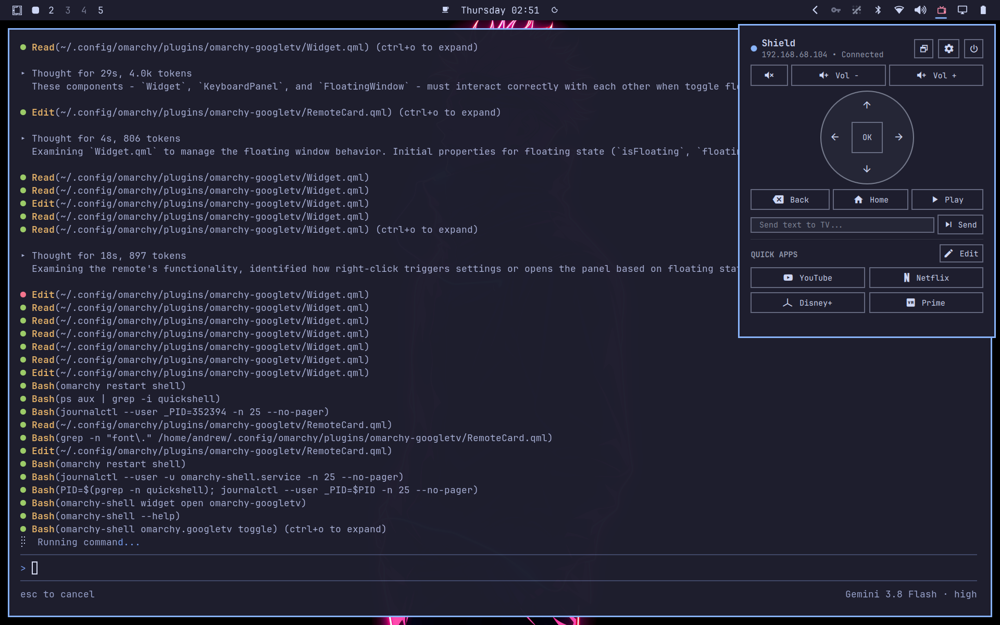
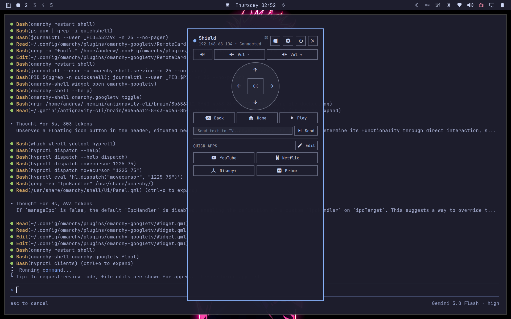

# Google TV & Android TV Remote Plugin for Omarchy Shell

[](https://omarchy.org/)
[](LICENSE)
[](https://android.googlesource.com/)

A modern, tactile, and responsive Google TV and Android TV remote control widget for the [Omarchy](https://omarchy.org/) status bar and desktop.

Seamlessly toggle between a compact status-bar popup and a persistent, draggable floating desktop window. Control playback, navigate menus, launch custom apps with 1 click, and send typed text directly to your TV.

---

## Previews

| Docked Status Bar Mode | Detached Floating Window Mode |
| :---: | :---: |
|  |  |

---

## Highlights & Features

### 1. Dual Display Modes: Docked & Floating
- **Docked Bar Popup**: Cleanly integrated with the Omarchy status bar. Clicking outside auto-dismisses the remote.
- **Detached Floating Window**: Click the float button (`󰖲`) in the header to detach the remote into a standalone, persistent desktop window.
- **Pinned Across Workspaces**: Stays pinned across all workspaces so you can switch tasks without losing your remote.
- **Drag Anywhere**: Click and drag the remote title / header area (or use `Super + Left-Click`) to reposition the window anywhere on your screen.
- **Instant Re-Docking**: Click the dock button (`󰖳`) to instantly dock it back to the status bar.

### 2. Full Android TV Remote Controls
- **Power**: Turn TV on/off or toggle standby state (`󰐥`).
- **Tactile D-Pad**: Directional Up, Down, Left, Right and Center/OK selection.
- **Volume & Mute**: Instant Vol +, Vol -, and Mute buttons.
- **Navigation**: Back, Home, and Media Play/Pause buttons.
- **Keyboard Navigation**: Drive the remote from your PC keyboard when focused:
  - Arrow Keys: D-Pad Navigation
  - `Enter`: OK / Select
  - `Backspace` / `b`: Back
  - `Home` / `h`: Home
  - `Space` / `p`: Play / Pause
  - `+` / `-`: Volume Up / Down
  - `m`: Mute

### 3. Send Text / Live Keyboard Typing
- Integrated text input field directly on the remote.
- Type search queries, YouTube titles, URLs, or passwords and press `Enter` (or click **Send**) to beam text directly into the active text field on your TV.
- Automatically disables global remote keybindings while typing to prevent accidental navigation.

### 4. 4 Programmable Quick App Buttons
- 4 customizable slots (2x2 grid) displayed directly on the remote interface.
- **15 Built-in 1-Click Presets**:
  - YouTube, Netflix, Disney+, Prime Video, Plex, Spotify, Twitch, Apple TV, Max, Kodi, SmartTube, Jellyfin, Hulu, Crunchyroll, and VLC.
- **Custom Deep Link Support**: Deep linking should be used for reliable app launching. Built-in presets and package IDs are automatically resolved to verified deep links (`https://...` or `scheme://`). Custom apps can be bound directly to their URI schemes (e.g. `plex://`, `kodi://`, `https://tv.apple.com`).

### 5. Automatic Network Discovery & Multi-TV Management
- **mDNS Network Scanning**: Automatically scans your local network (`_androidtvremote2._tcp`) for connected Google TVs, Android TVs, and NVIDIA SHIELD devices.
- **Manual IP Addition**: Manually add any TV by IP address and custom label.
- **Multi-TV Switching**: Easily switch active control between multiple TVs in your household with one click.

### 6. Official Android TV Remote v2 Protocol (Zero-ADB)
- Connects securely using Google's official **Android TV Remote protocol v2** over TLS (port 6466).
- **No ADB or Developer Mode required**.
- Pairs with the standard 6-character alphanumeric code displayed on your TV screen.
- Completely local and private — no cloud services, accounts, or telemetry required.

### 7. Real-Time UNIX Domain Socket Daemon
- Button presses are processed via an asynchronous UNIX domain socket daemon (`~/.config/omarchy/googletv/daemon.sock`) for sub-millisecond responsiveness (~0.2ms latency).

---

## Installation

### Method 1: Using the Omarchy Plugin CLI (Recommended)

```bash
omarchy plugin add https://github.com/<your-username>/omarchy-googletv.git --enable
```

Then install the Python dependencies:

```bash
~/.config/omarchy/plugins/omarchy-googletv/setup.sh
```

### Method 2: Manual Installation

1. Clone the repository into your Omarchy plugins directory:
   ```bash
   git clone https://github.com/<your-username>/omarchy-googletv.git ~/.config/omarchy/plugins/omarchy-googletv
   ```

2. Run the dependency setup script:
   ```bash
   ~/.config/omarchy/plugins/omarchy-googletv/setup.sh
   ```

3. Enable the plugin in your status bar:
   ```bash
   omarchy plugin enable omarchy-googletv --section right
   ```

4. *(Optional but Recommended)* Add the floating window rule in `~/.config/hypr/looknfeel.lua`:
   ```lua
   -- Google TV Remote floating window
   o.window({ class = "^org.quickshell$", title = "^Google TV Remote$" }, {
     float = true,
     pin = true,
     size = "340 680",
   })
   ```
   Then reload Hyprland:
   ```bash
   hyprctl reload
   ```

---

## Pairing Your TV

1. Click the TV icon (`󰟴`) on your status bar.
2. If no TV is configured, click the **Settings** gear icon (`󰒓`).
3. Click **Scan Network for Google TVs** (or type your TV's IP address in the manual section).
4. Select your TV and click **Pair with this TV**.
5. Look at your TV screen — a 6-character code will be displayed.
6. Enter the 6-character code into the prompt and click **Confirm & Pair**.
7. Your TV is now paired and ready to control!

---

## CLI & Keybinding Integration

The backend CLI can also be used in terminal scripts or bound to custom Hyprland shortcut keys in `~/.config/hypr/bindings.lua`:

### Remote Keys
```bash
~/.config/omarchy/plugins/omarchy-googletv/backend.py key DPAD_UP
~/.config/omarchy/plugins/omarchy-googletv/backend.py key DPAD_CENTER
~/.config/omarchy/plugins/omarchy-googletv/backend.py key HOME
~/.config/omarchy/plugins/omarchy-googletv/backend.py key BACK
~/.config/omarchy/plugins/omarchy-googletv/backend.py key VOLUME_UP
~/.config/omarchy/plugins/omarchy-googletv/backend.py key VOLUME_DOWN
~/.config/omarchy/plugins/omarchy-googletv/backend.py key MEDIA_PLAY_PAUSE
~/.config/omarchy/plugins/omarchy-googletv/backend.py key POWER
```

### Launch Apps
```bash
~/.config/omarchy/plugins/omarchy-googletv/backend.py launch com.google.android.youtube.tv
~/.config/omarchy/plugins/omarchy-googletv/backend.py launch com.netflix.ninja
```

### Send Text
```bash
~/.config/omarchy/plugins/omarchy-googletv/backend.py text "Interstellar"
```

### Shell IPC Commands
```bash
# Toggle remote (opens/closes whichever mode is active)
omarchy-shell omarchy.googletv toggle

# Toggle between docked and floating desktop remote
omarchy-shell omarchy.googletv toggleFloat

# Force float mode
omarchy-shell omarchy.googletv float

# Force dock mode
omarchy-shell omarchy.googletv dock
```

---

## File Architecture

```
~/.config/omarchy/plugins/omarchy-googletv/   # Plugin Source (tracked in git)
├── manifest.json                            # Omarchy plugin manifest
├── Widget.qml                               # Main bar widget & window coordinator
├── RemoteCard.qml                           # Reusable UI card (docked & floating)
├── backend.py                               # Python daemon & CLI protocol engine
├── setup.sh                                 # Secure dependency installer (--require-hashes)
├── requirements.lock                        # Pinned dependencies with verified SHA-256 hashes
├── scripts/
│   └── lock-dependencies.py                 # Dependency hash verification script
├── LICENSE                                  # MIT License
├── README.md                                # Documentation
└── assets/                                  # Preview screenshots

~/.config/omarchy/googletv/                  # Local State & User Configuration
├── config.json                              # Configured TVs, active TV, button slots
├── daemon.sock                              # Fast UNIX domain socket
├── daemon.pid                               # Daemon process ID
├── certs/                                   # TLS client certificate and private key
└── .venv/                                   # Python virtual environment
```

---

## License

MIT License. See [LICENSE](LICENSE) for details.
